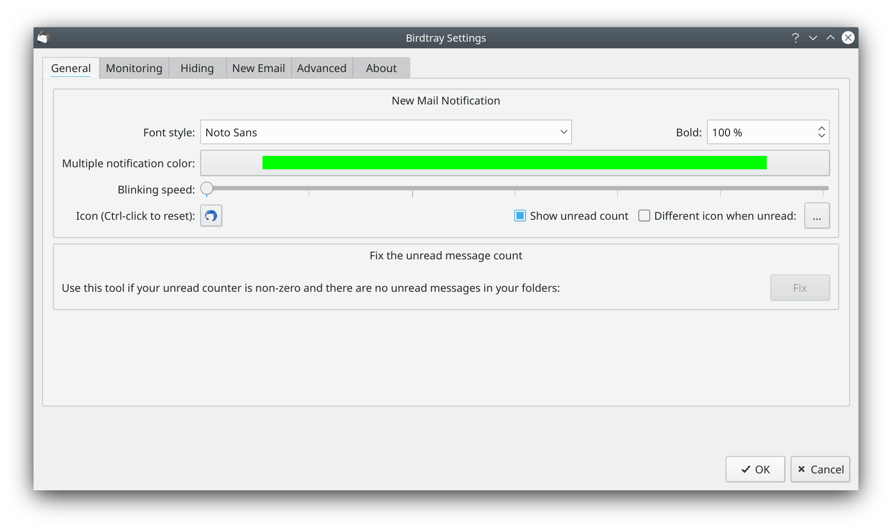

# Birdtray is a system tray new mail notification for Thunderbird, which does not require extensions. [](https://github.com/gyunaev/birdtray/action)

Birdtray is a free system tray notification for new mail for Thunderbird. It supports Linux and Windows (credit for adding and maintaining Windows support goes to @Abestanis). Patches to support other platforms are welcome.

## Features

- Shows the unread email counter in the Thunderbird system tray icon;

- Optionally can animate the Thunderbird system tray icon if new mail is received;

- You can snooze new mail notifications for a specific time period;

- Birdtray checks the unread e-mail status directly by reading the Thunderbird email mork database. This means it does not need any extensions, and thus is immune to any future extension API changes in Thunderbird;

- Starting from version 0.2 if you click on Birdtray icon, it can hide the Thunderbird window, and restore it. There is also context menu for that (this currently only works on Linux);

- You can configure which accounts you want to check for unread emails on;

- You can choose different font colors for different email accounts. This allows you, for example, to have blue unread count for personal emails, red unread count for work emails, and green unread count if both folders have unread mail.

- Can launch Thunderbird when Birdtray starts, and terminate it when Birdtray quits (configurable).

- You can choose the tray icon, or use Thunderbird original icon;

- Can monitor that Thunderbird is running, and indicate it if you accidentally closed it;

- Has configurable "New Email" functionality, allowing pre-configured email templates.


## Building

To build Birdtray from source, you would need the following components:

- A C++ compiler
- Cmake
- Qt 5.6 or higher with "x11extras-dev" or "x11extras-devel"  module installed (it is usually NOT installed by default);

On Debian you need to install the following packages: ``qt5-default libqt5x11extras5-dev qttools5-dev libqt5svg5-dev libx11-xcb-dev``

On OpenSuSE you need to install ``libqt5-qtbase-devel libqt5-qtx11extras-devel libqt5-qtsvg-devel``

On Fedora (30 or later) you need to install ``qt5-qtbase-devel qt5-qtx11extras-devel qt5-qtsvg-devel``

To build, please do the following:

```shell script
mkdir build
cd build
cmake -DCMAKE_BUILD_TYPE=Release ..
cmake --build .
```

Launch the `./birdtray` executable from the build directory.

## Installation

Run `cmake --build . --target install` to install Birdtray.
On Unix systems, you can configure the install location by running
`cmake -DCMAKE_BUILD_TYPE=Release -DCMAKE_INSTALL_PREFIX=/usr ..` before the command above.
On Windows, the command will build a graphical installer and execute it.
It requires [NSIS](https://nsis.sourceforge.io/Main_Page) to be installed on your system.
It is recommended for Windows users to use the
[precompiled installers for the latest release](https://github.com/gyunaev/birdtray/releases/latest).  

## Usage

Once started, Birdtray will show the Thunderbird icon in system tray.

Right-click on this icon, and click Settings. Go to Monitoring tab ans select the Thunderbird MSF file for the mailbox you'd like to monitor. You can specify different notification colors for each mailbox. Birdtray will show the new email count using this color if only this folder has new mail. If more than one folder has new mail, the default color will be used.

Then select the font and default color (which will be used if more than one monitored folder has new mail).

You can also enable birdtray to start Thunderbird when you start Birdtray, or enable show/hide Thunderbird when the system tray icon is clicked, in settings.

Once you change settings, often you need to restart birdtray for the new settings to take effect.

### Configuration File Location
*Birdtray configuration is stored on a per-user basis, where the location differs depending on environment, as follows:*

#### Linux Package Installation
`$HOME/.config/birdtray-config.json`

#### Linux Flatpak Installation
`$HOME/.var/app/com.ulduzsoft.Birdtray/config/ulduzsoft/birdtray-config.json`

#### Windows Installation
`%LocalAppData%\ulduzsoft\birdtray\birdtray-config.json`

## Troubleshooting

If Birdtray shows the wrong number of unread messages, it can be caused by a corrupt mork file.
This can often be fixed by using the `Repair` functionality in Thunderbird
in the mail folder settings.

Generally Birdtray expects a spec-compliant desktop manager. If you're using a barebone or non-standard/light/simple desktop manager, it is very likely that some features of Birdtray will not work properly. Most likely candidates are hiding and restoring Thunderbird window(s) - including their position and state. But sometimes even a system tray icon isn't shown. Linux Mint with Cinnamon seem to be one particularly troublesome distro which reports many issues.

## Submitting bugs and feature requests

Please use Github issue tracker. Please attach the log output, if relevant. It could be obtained from Settings -> Advanced (tab) -> Show Log Window (button) -> copy-paste from it into bug report.

### Translations

Translations are maintained by the community.
If you want to add a translation, you can follow [this guide](https://github.com/gyunaev/birdtray/wiki/Add-a-new-translation)
and if you want to edit an existing translation, read [this page](https://github.com/gyunaev/birdtray/wiki/Edit-an-existing-translation).

## Author and license

Birdtray is written by George Yunaev, and is licensed under GPLv3 license.


